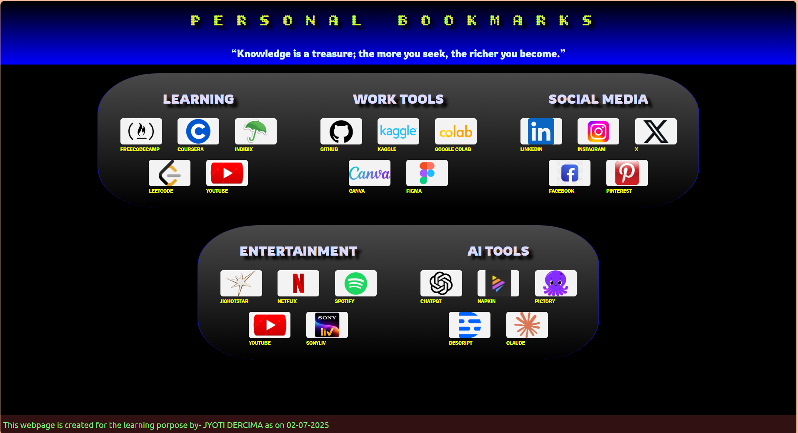
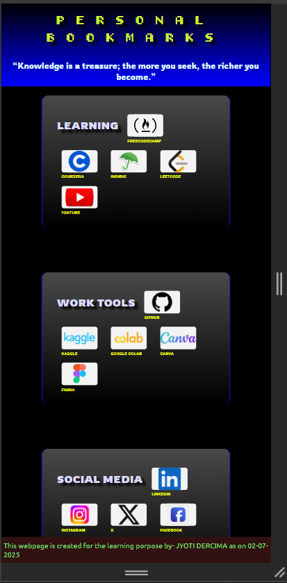

# Personal Bookmark Dashboard
A clean, responsive HTML & CSS dashboard that serves as a custom browser homepage with all your daily-use links organized by category — like Learning, Work Tools, Social Media, AI Tools, and Entertainment.
🔗Live Demo
🔗 [View Live](https://personal-bookmark-dashboard.vercel.app/)
 
🛠️Tech Stack
- HTML5
- CSS3
- Flexbox & Grid
- Media Queries
- Google Fonts
 
🎯Features
- Clean and minimal user interface
- Fully responsive layout for all screen sizes
- Organized bookmarks by category
- Icon-based buttons with hover effects
 
🎨Screenshots
## Desktop View

## Mobile View

 
📚What I Learned
- Practiced semantic HTML and clean structure
- Deepened understanding of Flexbox and Grid
- Improved responsive design skills
- Learned the importance of spacing, alignment, and visual hierarchy
 
🚧Challenges Faced
After a learning gap, I realized I was forgetting CSS concepts, which highlighted the importance of regular revision and practice. This project reminded me to keep building and applying what I learn, rather than just consuming content and assuming I know what I learned earlier.
 
🧠Future Improvements
- Make bookmarks dynamic using JavaScript
- Creating it look more professional
- Create a version that stores data with local storage or a backend
 
📌How to Use
1. Clone the repo
2. Open `index.html` in your browser
3. Customize the links and icons as per your needs
